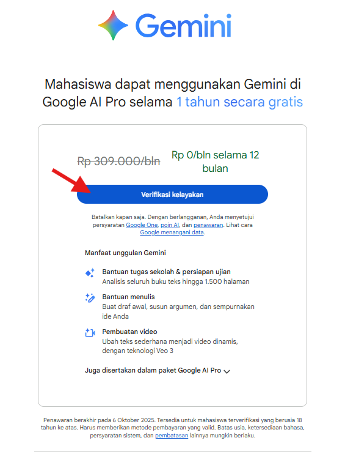
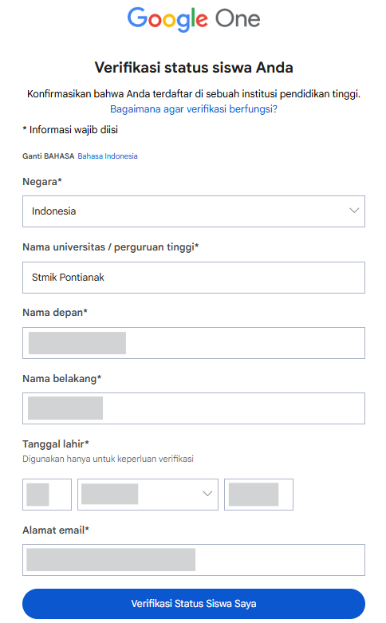
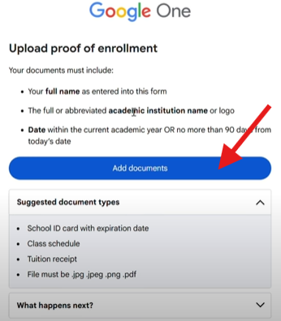
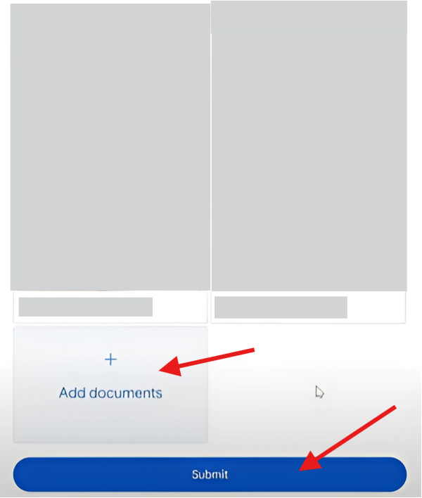
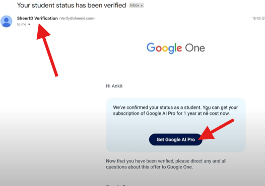
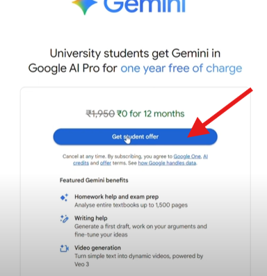
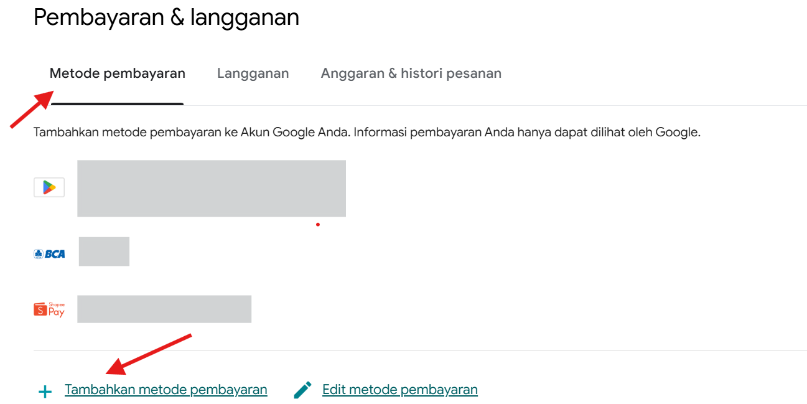
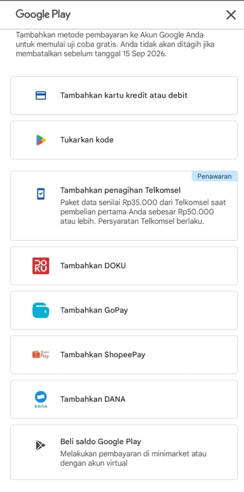
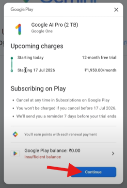
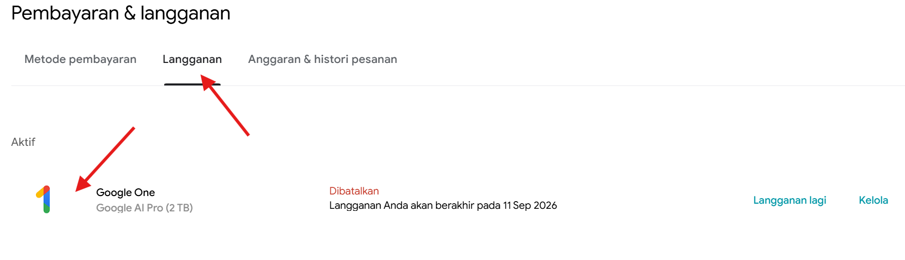

# 📌 Panduan Upgrade Google Gemini Pro (Google AI Pro) untuk Mahasiswa

Google memberikan **penawaran khusus untuk mahasiswa** berupa akses **Google AI Pro (Gemini Pro)** gratis selama 1 tahun yang diverifikasi oleh **SheerID**.

Berikut adalah langkah-langkah upgrade beserta screenshot prosesnya:

---

## 1. Halaman Promo Resmi Gemini Pro
Penawaran resmi menunjukkan harga normal, namun mahasiswa mendapatkan gratis 12 bulan penuh setelah verifikasi. Klik "Verifikasi kelayakan" untuk memulai.

---

## 2. Isi Formulir Data Diri Mahasiswa 
Lengkapi data diri Anda sesuai dengan status kemahasiswaan pada formulir yang disediakan.

Klik **Verifikasi Status Siswa Saya** apabila sudah melakukan pengisian.  

Note: **Pengguna akan diarahkan untuk memasukkan email instansi (email  universitas atas siswa apabila ada) dan jikalau tidak ada silahkan klik kembali atau akan terbuka di tab lain untuk melanjukan ke upload dokumen bukti mahasiswa**

---

## 3. Upload Dokumen Bukti Mahasiswa

Unggah dokumen bukti mahasiswa yang valid. Disarankan melakukan upload dokumen:
- Kartu Tanda Mahasiswa (KTM), *memuat tanggal berlaku di tahun 2025 ini*. Apabila Tidak memuat tanggal berlaku di tahun 2025 ini maka dapat dilengkapi dengan:
- Jadwal Kuliah 
- KRS Mahasiswa --> **[klik disini](https://stmikpontianak.cloud/StmikKrs/login.tw)**

Dokumen yang dapat digunakan untuk verifikasi dapat dilihat pada **[link SheerID berikut](https://support.sheerid.com/en-US/help-center/student/)**.  
Jika mengalami kendala terkait verifikasi, silakan mengirimkan email ke **customerservice@sheerid.com** (layanan hanya tersedia dalam Bahasa Inggris).

---

## 4. Submit Dokumen
Setelah memilih dokumen yang diminta, klik Submit untuk mengirimkannya.

---

## 5. Proses Upload Berjalan Pro untuk Mahasiswa
Biarkan jendela tetap terbuka hingga dokumen selesai diunggah dan diverifikasi oleh sistem.

---

## 6. Verifikasi Diterima
Jika dokumen valid, status Anda akan diverifikasi dan Anda dapat melanjutkan untuk mengklaim penawaran dengan klik **Get Google AI Pro**.

---

## 7. Email Konfirmasi dari SheerID
Anda akan menerima email resmi dari SheerID Verification yang menyatakan status mahasiswa sudah berhasil diverifikasi. Klik tombol di email untuk melanjutkan.

---

## 8. Klaim Penawaran Gemini Pro untuk Mahasiswa
Klik tombol **"Get student offer"** untuk melanjutkan proses klaim.

---

## 9. Tambahkan Metode Pembayaran di Google Play
Meskipun gratis, Anda diminta menambahkan metode pembayaran sebagai formalitas. Anda tidak akan ditagih jika membatalkan sebelum masa promo berakhir.

**Note:**  
- Pastikan metode pembayaran yang kamu input valid, dan untuk kartu debit/kredit/e-wallet telah diaktifkan untuk transaksi online.
- Jika opsi e-wallet tidak muncul, silakan ke https://play.google.com/store/paymentmethods untuk menambahkan secara manual sebelum mencoba kembali.

 
- Dianjurkan memiliki saldo sekitar Rp 20.000 untuk verifikasi.
 

---

## 10. Konfirmasi Langganan Gratis
Anda akan melihat detail bahwa langganan gratis selama 12 bulan. Klik **"Continue"** untuk menyelesaikan.

---

# ✅ Selesai
Sekarang Anda sudah berhasil mengaktifkan **Google AI Pro (Gemini Pro)** gratis selama **1 tahun** dengan status mahasiswa. 🎉
 

--- 

# 🚫 Membatalkan Langganan
Anda dapat melakukan pembatalan langganan sekarang, tetapi tenang... status akan tetap gratis selama 1 tahun.
